**Author:** Fangfang
## Introduction

Modern game engines generally rely heavily on code generation technologies, which typically use original code as the source of information for further processing, combined with dedicated configurations. Over time, this has evolved into an integrated form of original code and configurations. For instance, the well-known Unreal Engine (UE) uses macros to inject additional information into the original code, and then employs its specialized Unreal Header Tool (UHT) to achieve the purpose of code generation. The early version of UHT, written in C++, adopted a 2-pass method to parse related header files, extract necessary information, and generate code. The latest UE5 has rewritten the entire UHT in C#, which is more friendly for string processing, providing a more complete implementation and better handling of various C++ tokens compared to previous versions. The 3D engine developed by Tencent IEG, which I participated in, also makes extensive use of code generation technology. Unlike UE, we chose not to develop our own code generation tool from scratch. Instead, based on historical experience and after re-evaluation, we opted to extract original code information at the C++ Abstract Syntax Tree (AST) level for code generation. Initially, we used Python Wrapper of libclang for this task. However, due to unsatisfactory maintenance costs and execution efficiency, we conducted further research and chose CppAst.Net, which also uses libclang at the lower level but with a more rational overall design and user-friendly implementation, to complete this part of the work. Of course, the process was not smooth sailing. After submitting several key feature PRs to CppAst.Net, we were able to use CppAst.Net effectively for our code parsing and additional information injection needs. This article will focus on all aspects of the C# library - CppAst.Net, aiming to help everyone better complete tools related to C++ code analysis or code generation.

---
## 1. Introduction to Code Generation

As mentioned in the introduction, modern game engines generally rely heavily on code generation technology. Let's look at a practical example from the IEG self-developed engine CE - the reflection registration code for the Vector3 class:

**Vector3 class in C++:**
```cpp
//-------------------------------------
//declaration
//-------------------------------------
class Vector3 {
 public:
  double x;
  double y;
  double z;
 public:
  Vector3() : x(0.0), y(0.0), z(0.0) {}
  Vector3(double _x, double _y, double _z) : x(_x), y(_y), z(_z) {}
  double DotProduct(const Vector3& vec) const;
};
```

**Reflection registration code for the Vector3 class:**
```cpp
//-------------------------------------
//register code
//-------------------------------------
__register_type<Vector3>("Vector3")
		.constructor()
		.constructor<double, double, double>()
		.property("x", &Vector3::x)
		.property("y", &Vector3::y)
		.property("z", &Vector3::z)
		.function("DotProduct", &Vector3::DotProduct);
		;
```
This allows for the reflection registration of its constructors and several properties, enabling us to use it through the reflection library. In actual engineering applications, manually implementing registration code for each class is one approach, but this method is obviously labor-intensive and prone to errors, such as failing to update the registration part of the code when modifying the original implementation, which is not a particularly advisable method.
In such cases, we would consider using a more "automated" mechanism to solve the problem of generating registration code. This is the approach currently chosen by CE. The overall process of automatically generating reflection code in CE is illustrated in the following figure:
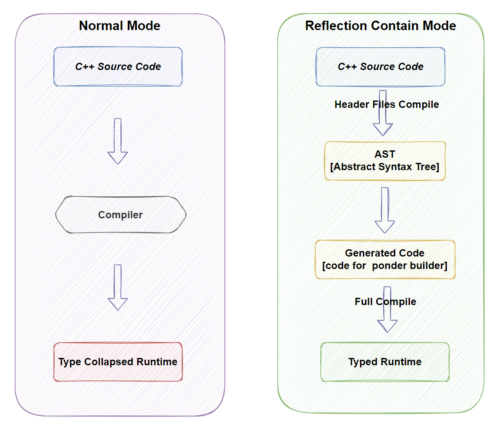
Compared to the conventional `C++` compilation process [as shown in the Normal Mode in the figure], we strategically arrange the compilation pipeline, using `libclang`, to create a secondary `Compile` process as shown on the right side:
- The first compilation occurs within the tool, processing only header files to extract necessary information, such as class definitions.
- The second compilation is the actual normal compilation process, incorporating the additional files generated by the tool into the entire compilation.
Thus, by compiling the tool-generated registration code together with the original code, we can obtain a reflection system with complete runtime information.
The principle of automatically generating the middleware layer for scripting languages is similar to this scenario. By utilizing this `header-only libclang compile` mode, we can effectively organize the implementation logic of offline tools to complete the required code generation. Doesn't it seem like a promising situation?

---
## 2. `libclang` - Bringing Hope And Confusion

Before the existence of LLVM libraries, we could only rely on string pattern matching methods like regex to accomplish related tasks. The major drawbacks of this approach were, on one hand, its inefficiency, and on the other hand, the way business programs organized code could disrupt the functioning of automation tools, making the troubleshooting and pinpointing of issues less straightforward. With the advent of LLVM libraries, an increasing number of people started to explore extracting source code information at the AST (Abstract Syntax Tree) level. This approach shifted the resolution of related issues back to C++ itself, which is undoubtedly much more stable and controllable than the previously mentioned string-based mechanisms, with issues being easier to locate and troubleshoot. To utilize this method, let’s first get a basic understanding of libclang.


### 2.1 `libclang` And The Changes It Brings

libclang is a part of the LLVM toolchain, and the overall working process of LLVM can be simplified as shown in the diagram below:
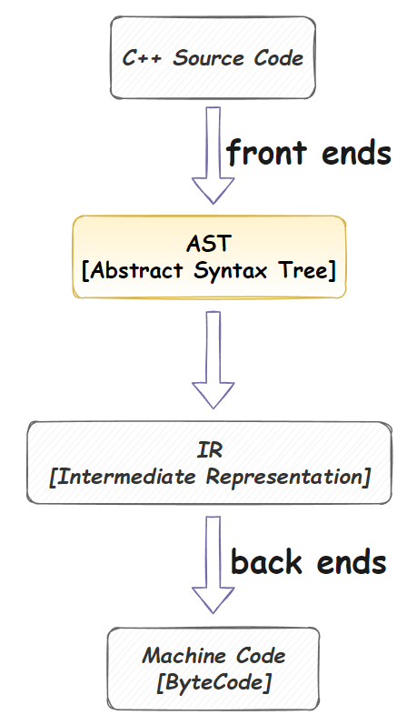

libclang is primarily used for the conversion of C++ source code to AST. Our code generation tool mainly leverages this capability to generate code based on some configuration information after obtaining the AST.

Just like the CE solution introduced above, based on libclang and secondary compilation, we can design a very streamlined process for offline code generation tools. However, various issues can still arise in the actual implementation process of offline tools based on libclang:
1. Compilation issues with libclang - the complexity increases in cross-platform usage. [Refer to this article for some details](https://zhuanlan.zhihu.com/p/522301633)
2. Choosing the language for using libclang: C++, Python, C#, or others?
3. How to effectively support the extensive use of various template types in C++?
4. How to solve the marking of generated information and the injection of additional information, such as the extensive use of Properties in UE that are utilized in the Editor?
5. How to better organize generated code to avoid the presence of extensive string concatenation code in tools?

Besides the issues listed above, there are also problems brought about by the complexity of libclang and C++ itself:


### 2.2 Limitations Brought by libclang's Cursor Mechanism

libclang expresses AST through the concept of Cursors. 

For example, for the following class:
```cpp
namespace math {

class Ray {
 protected:
  Vector3 mOrigin;
  Vector3 mDirection;
 public:
  Ray();
  Ray(const Vector3& origin, the Vector3& direction);

  /** Sets the origin of the ray. */
  void setOrigin(const Vector3& origin);
  //... something ignore here
};

} // namespace math
```

**The corresponding AST is as follows:**
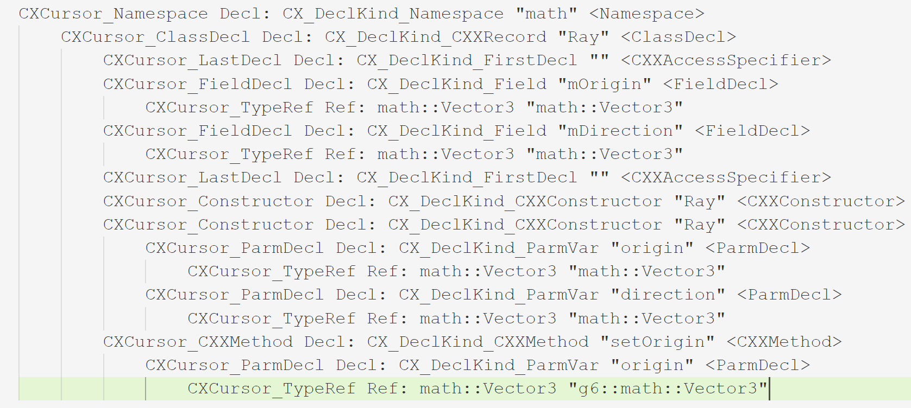

Understanding the role of Cursors in the AST in correspondence with the source code is relatively straightforward. We can see that libclang constructs the entire AST using various types of CXCursor, with the higher complexities mainly concentrated in the Stmt and Exprs parts. However, since the relationship with the source code syntax is almost one-to-one, it becomes relatively quick to get accustomed to. Below is a classification of CXCursor types:
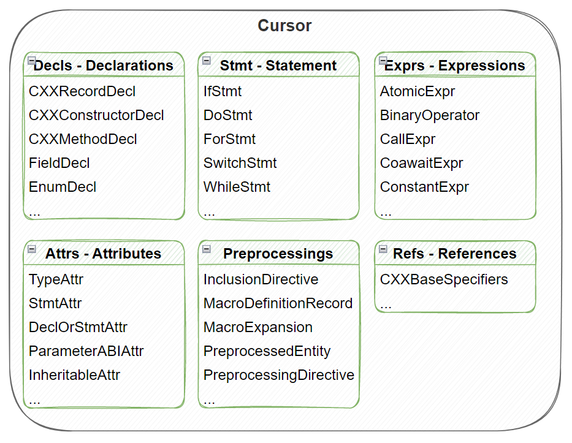
There are no significant barriers to the categorization and use of CXCursor itself. However, libclang's primary method of accessing a node's children is more provided in a callback manner, as demonstrated in the partial code used to dump a CXCursor's information:
```cs
private static void PrintASTByCursor(CXCursor cursor, int level, List<string> saveList)
{
    bool needPrintChild = true;
    saveList.Add(GetOneCursorDetails(cursor, level, out needPrintChild));

    unsafe
    {
        PrintCursorInfo cursorInfo = new PrintCursorInfo();
        cursorInfo.Level = level + 1;
        cursorInfo.SaveList = saveList;
        GCHandle cursorInfoHandle = GCHandle.Alloc(cursorInfo);

        cursor.VisitChildren(VisitorForPrint,
            new CXClientData((IntPtr)cursorInfoHandle));
    }
}
```

This posed a significant inconvenience for us in implementing code analysis and generation tools, as our tools often couldn't process the AST in a single pass. Many tasks required repeated access to a particular CXCursor and its children to be completed.
  Therefore, in an older project at Tencent, we accessed libclang through C# (using ClangSharp). At that time, we attempted to completely save a layer of data from libclang within the C# layer. Of course, this data layer was also obtained in one go through libclang's native callback mechanism. This way, the offline tool was decoupled from libclang's native AST, eliminating the issues related to libclang callbacks and the inconvenience of multiple data retrievals. After incorporating the C# data layer, the entire processing flow was as follows:
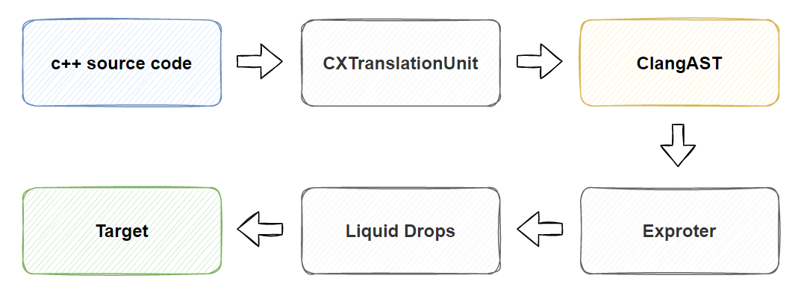

However, there were some issues with this implementation, including the use of both ClangSharp's LowLevel and HighLevel interfaces, with the HighLevel interface's implementation quality not being very high. Additionally, due to the presence of the intermediate data layer, the total volume of implementation code was not insignificant, and the complexity of getting started with related tools did not decrease. This was also a major reason for considering a switch to CppAst.Net implementation later on.


### 2.3 Complexity of the C++ Type System

Besides the issues brought by libclang itself, the complex type system of C++ is also a significant challenge for offline generation tools. As shown in the figure below, we present a rough classification of types in C++:
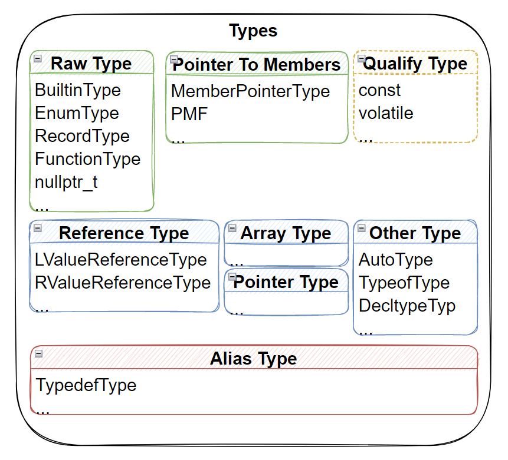

The complexity of the type system is mainly reflected in:
- The numerous builtin types in C++
- Users can extend a large number of UDTs (such as classes and enums) through custom methods
- C++ supports advanced types like Pointers, References, and Arrays, which can be nested within each other
- Types can be modified with `const`, `volatile`, etc., forming new types
- We can also specify aliases for types using `using` and `typedef`
- With the expansion of keywords from C++11 onwards, we might use `auto`, `decltype`, `typeof` for type expression
- The support for templates introduces a more complex system for expressing types (which is quite complex and will be skipped in this article).

Thus, the complexity of the entire type system is ever-increasing, with the main challenges for offline tools concentrated in this area.

When parsing a Type from a Cursor, often we need to analyze it layer by layer before finally determining its actual type. This is actually one of the advantages of CppAst.Net that we will discuss later; it has a relatively complete implementation of C++'s type system at the C# layer. Although the complexity of the type system itself still exists, we can handle various types in a way that is quite close to native C++, coupled with C#'s runtime complete type information, many issues can be effectively simplified.


---
## 3. CppAst.Net - A New Ceiling

After a lengthy introduction, we finally arrive at our main topic, [CppAst.Net](https://github.com/xoofx/CppAst.NET). Following tradition, **let's start with an example code from the CppAst.Net official website:**
```cs
// Parse C++ files
var compilation = CppParser.Parse(@"
enum MyEnum { MyEnum_0, MyEnum_1 };
void function0(int a, int b);
struct MyStruct { int field0; int field1; };
typedef MyStruct* MyStructPtr;
");

// Print diagnostic messages
foreach (var message in compilation.Diagnostics.Messages)
    Console.WriteLine(message);

// Print all enums
foreach (var cppEnum in compilation.Enums)
    Console.WriteLine(cppEnum);

// Print all functions
foreach (var cppFunction in compilation.Functions)
    Console.WriteLine(cppFunction);

// Print all classes, structs
foreach (var cppClass in compilation.Classes)
    Console.WriteLine(cppClass);

// Print all typedefs
foreach (var cppTypedef in compilation.Typedefs)
    Console.WriteLine(cppTypedef);
```
**Corresponding output:**
```cs
enum MyEnum {...}
void function0(int a, int b)
struct MyStruct { ... }
typedef MyStruct* MyStructPtr
```

From the above example, we can already see some advantages of CppAst.Net:
1. The C# side provides various high-level types, such as CppFunction, CppClass, CppEnum, etc. The AST reorganized on the C# side can also be accessed directly using a foreach loop without relying on callbacks.
2. It supports building Compilation directly from a string, which also facilitates the implementation of unit tests.

### 3.1 Easy to Start with Simple Configuration
&emsp;&emsp;CppAst.Net fundamentally relies on ClangSharp. Those who have experience with ClangSharp might be aware that the compilation and execution experience may not be very smooth. After adding the ClangSharp package from NuGet, attempting to run related examples and test codes might still prompt issues such as the absence of `libclang.dll/ligclang.so`, leading to a less than ideal experience. This situation can't be entirely blamed on ClangSharp, as it mainly stems from NuGet's limitations on the size of native binaries that a package can depend on. Since this issue might be encountered by many, let's first share a workaround to facilitate easier running of your own test codes:
```xml
<PropertyGroup>
    <!-- Workaround for issue https://github.com/microsoft/ClangSharp/issues/129 -->
    <RuntimeIdentifier Condition="'$(RuntimeIdentifier)' == '' AND '$(PackAsTool)' != 'true'">$(NETCoreSdkRuntimeIdentifier)</RuntimeIdentifier>
</PropertyGroup>
```

For the official sample codes mentioned earlier, we can try to start from scratch and create a `C# .netcore 3.1` Console App, and step by step get it to run:

#### 3.1.1 Creating a Project
**Open Visual Studio and create a C# Console App (the environment used by the author is VS 2022):**
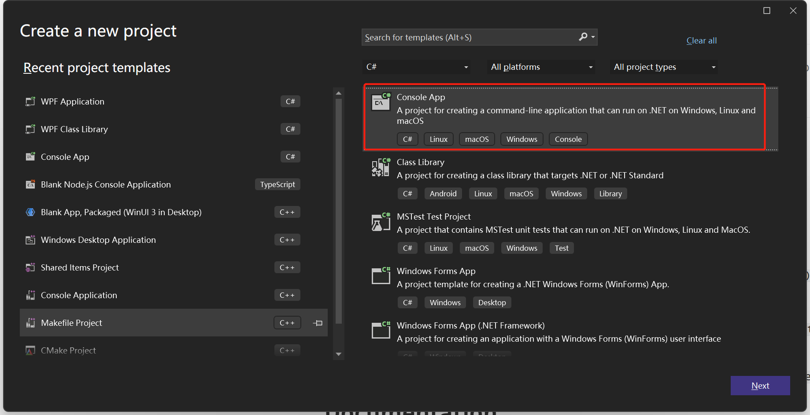

**Configure the project name:**
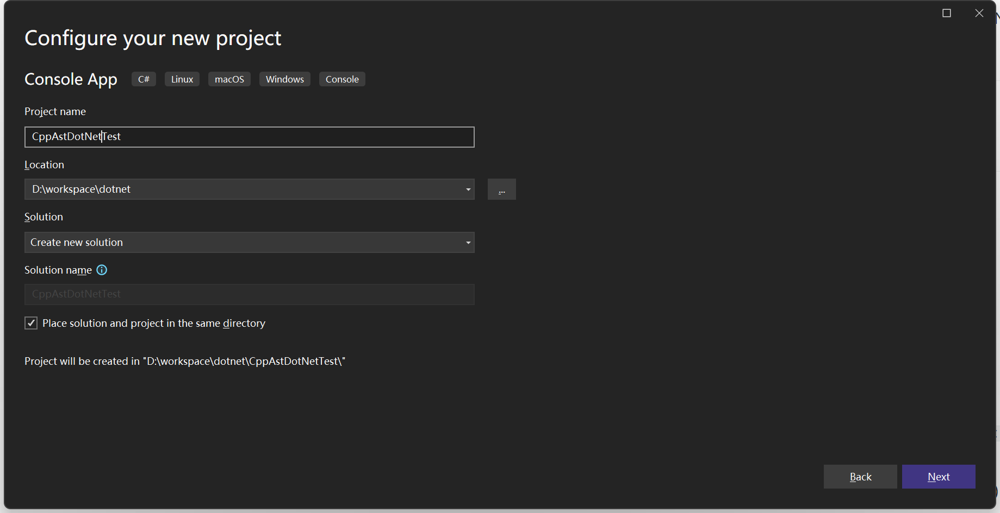

**Select the .net version (here we directly use .net core 3.1):**
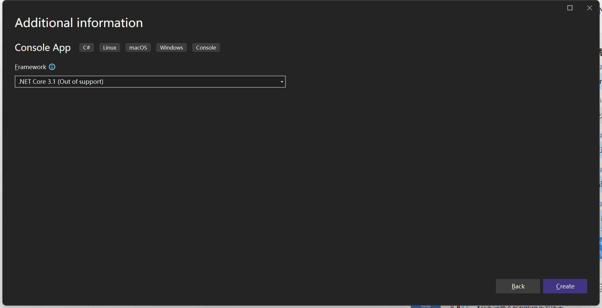

#### 3.1.2 Adding `CppAst.Net` Package via NuGet
**Open the NuGet package manager:**
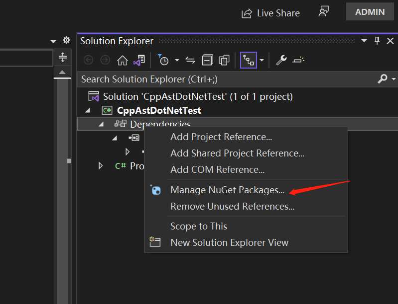

**Add the CppAst.Net package:**
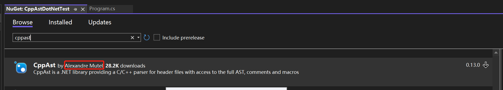

**After the operation, we can see the CppAst.Net package in the project's dependencies:**
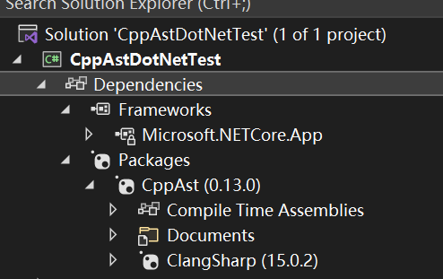

#### 3.1.3 Workaround for csproj
&emsp;&emsp;We also need to apply a workaround for the native dll not found issue mentioned earlier. Open the project's csproj file for editing, add the previously mentioned workaround, and correctly configure the information needed to load the native dll:
```xml
<Project Sdk="Microsoft.NET.Sdk">

  <PropertyGroup>
    <OutputType>Exe</OutputType>
    <TargetFramework>netcoreapp3.1</TargetFramework>

    <!-- Workaround for issue https://github.com/microsoft/ClangSharp/issues/129 -->
    <RuntimeIdentifier Condition="'$(RuntimeIdentifier)' == '' AND '$(PackAsTool)' != 'true'">$(NETCoreSdkRuntimeIdentifier)</RuntimeIdentifier>
  </PropertyGroup>

  <ItemGroup>
    <PackageReference Include="CppAst" Version="0.13.0" />
  </ItemGroup>

</Project>
```
The `RuntimeIdentifier` entry is essential, as omitting it could lead to runtime errors due to missing libclang native dlls.

#### 3.1.4 Adding Sample Code and Testing the App
**Add test code in the Main() function of Program.cs:**
```cs
static void Main(string[] args)
{
	// Parse a C++ files
	var compilation = CppParser.Parse(@"
enum MyEnum { MyEnum_0, MyEnum_1 };
void function0(int a, int b);
struct MyStruct { int field0; int field1;};
typedef MyStruct* MyStructPtr;
"
	);
	// Print diagnostic messages
	foreach (var message in compilation.Diagnostics.Messages)
		Console.WriteLine(message);

	// Print All enums
	foreach (var cppEnum in compilation.Enums)
		Console.WriteLine(cppEnum);

	// Print All functions
	foreach (var cppFunction in compilation.Functions)
		Console.WriteLine(cppFunction);

	// Print All classes, structs
	foreach (var cppClass in compilation.Classes)
		Console.WriteLine(cppClass);

	// Print All typedefs
	foreach (var cppTypedef in compilation.Typedefs)
		Console.WriteLine(cppTypedef);


	Console.WriteLine("Hello World!");
}
```

**Compile and run the program:**
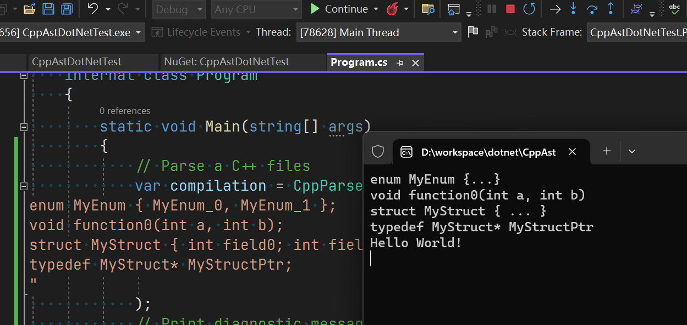

Our first CppAst.Net application is up and running, much simpler than expected, right? After discussing how to run sample code, let's turn back and explore the type system of CppAst.Net.


### 3.2 The Complete Type System Expressed on the C# Side
&emsp;&emsp;As mentioned earlier, CppAst.Net has several advantageous points, which we will summarize again here:
1. Simple configuration, supports parsing C++ code directly from a string.
2. A complete data layer on the C# side - after parsing, all information is transformed into C# and stored in CppCompilation, as we saw in the code earlier.
3. The reconstruction of the C++ type system in the C# layer is quite good.

This third point is evident from the class diagram of CppAst.Net:

Additionally, the implementation of specific C# types and properties, like the various attributes we saw on CppCompilation earlier:
- Namespaces - namespaces contained within the compilation unit.
- Enums - enums included in the compilation unit.
- Functions - functions (usually global functions) contained within the compilation unit.
- Classes - classes included in the compilation unit.
- Typedefs - typedef types contained within the compilation unit.
- ...
By reorganizing the entire AST's appearance on the C# side, we find that accessing and manipulating the C++ AST's information becomes simpler.


### 3.3 Understanding the Basic Functions of CppAst.Net Through Tests
&emsp;&emsp;To quickly grasp the basic functions of CppAst.Net, downloading the [source code](https://github.com/xoofx/CppAst.NET) of CppAst.Net and running the CppAst.Tests project is recommended. The code within focuses on testing specific functionalities, and most tests involve parsing C++ code from a string to generate CppCompilation, just like in our earlier example. This allows us to adjust the implementation for quick tests, making it very convenient to understand the features CppAst.Net offers.


---
## 4. Enhancing CppAst.Net
&emsp;&emsp;In actual use, we identified some missing functionalities in the original version of CppAst.Net (version 0.10), which we incrementally added in versions 0.11, 0.12, and 0.13, including:
1. Templates, including full and partial specializations.
2. Support for the FullName and Name of CppType.
3. High-performance implementation support for meta attributes.
These additions better supported our projects and also contributed back to the CppAst.Net open-source library:
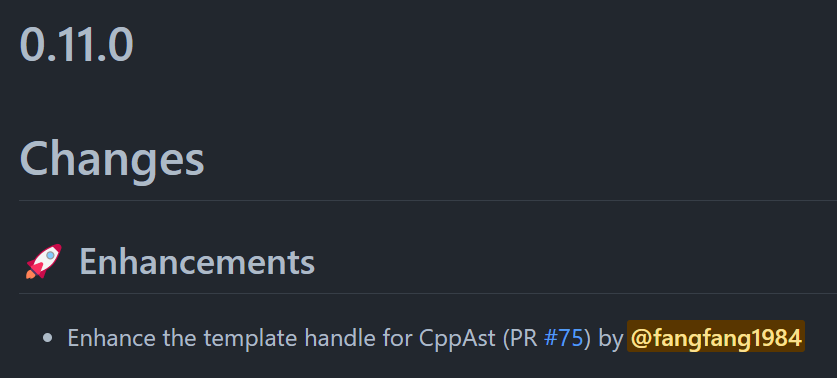

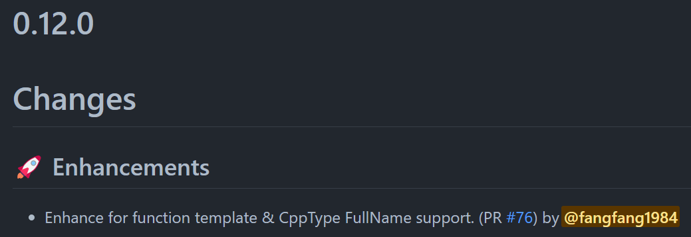

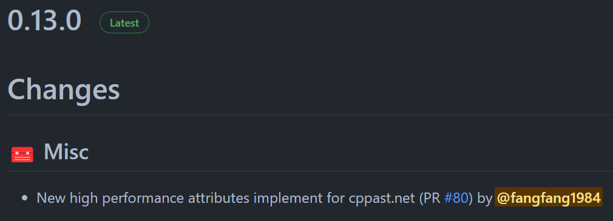
This collaboration method feels quite effective. By integrating CppAst.Net, we initially reduced a large amount of self-maintained code to a third-party library, which could be used directly via NuGet packages, greatly simplifying the learning curve for other team members. Moreover, during the project's implementation, we identified areas where CppAst.Net could be improved or was lacking in functionality. By addressing these areas and contributing back to the open-source library, we also made CppAst.Net more comprehensive and user-friendly. The following sections will detail the template-related functionalities and the meta attribute functionalities.


### 4.1 Support and Handling of Templates

&emsp;&emsp;When submitting the PR related to templates, since multiple commits were submitted at once, one of the PRs was missed. Thus, when the community noticed an issue and submitted corresponding test code:
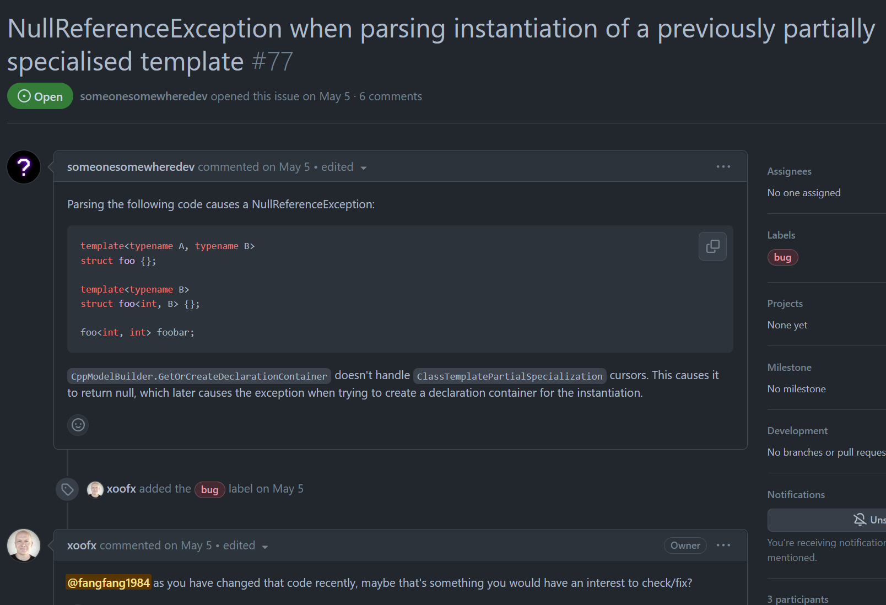

I then directly used this code for unit testing and fully added support for template partial specialization and specialization, allowing CppAst.Net to clearly differentiate between template parameters and template specialization parameters. This enables better retrieval of template and template specialization instance information. Let's look directly at the relevant unit test code:

```cs
       [Test]
        public void TestTemplatePartialSpecialization()
        {
            ParseAssert(@"
template<typename A, typename B>
struct foo {};

template<typename B>
struct foo<int, B> {};

foo<int, int> foobar;
",
                compilation =>
                {
                    Assert.False(compilation.HasErrors);

                    Assert.AreEqual(3, compilation.Classes.Count);
                    Assert.AreEqual(1, compilation.Fields.Count);

                    var baseTemplate = compilation.Classes[0];
                    var fullSpecializedClass = compilation.Classes[1];
                    var partialSpecializedTemplate = compilation.Classes[2];

                    var field = compilation.Fields[0];
                    Assert.AreEqual(field.Name, "foobar");

                    Assert.AreEqual(baseTemplate.TemplateKind, CppAst.CppTemplateKind.TemplateClass);
                    Assert.AreEqual(fullSpecializedClass.TemplateKind, CppAst.CppTemplateKind.TemplateSpecializedClass);
                    Assert.AreEqual(partialSpecializedTemplate.TemplateKind, CppAst.CppTemplateKind.PartialTemplateClass);

                    //Need be a specialized for partial template here
                    Assert.AreEqual(fullSpecializedClass.SpecializedTemplate, partialSpecializedTemplate);

                    //Need be a full specialized class for this field
                    Assert.AreEqual(field.Type, fullSpecializedClass);

                    Assert.AreEqual(partialSpecializedTemplate.TemplateSpecializedArguments.Count, 2);
                    //The first argument is integer now
                    Assert.AreEqual(partialSpecializedTemplate.TemplateSpecializedArguments[0].ArgString, "int");
                    //The second argument is not a specialized argument, we do not specialized a `B` template parameter here(partial specialized template)
                    Assert.AreEqual(partialSpecializedTemplate.TemplateSpecializedArguments[1].IsSpecializedArgument, false);

                    //The field use type is a full specialized type here~, so we can have two `int` template parmerater here
                    //It's a not template or partial template class, so we can instantiate it, see `foo<int, int> foobar;` before.
                    Assert.AreEqual(fullSpecializedClass.TemplateSpecializedArguments.Count, 2);
                    //The first argument is integer now
                    Assert.AreEqual(fullSpecializedClass.TemplateSpecializedArguments[0].ArgString, "int");
                    //The second argument is not a specialized argument
                    Assert.AreEqual(fullSpecializedClass.TemplateSpecializedArguments[1].ArgString, "int");
                }
            );
        }
```

In the process of actual use, we also discovered some functionality that was missing in the original version (0.10) of CppAst.Net. We gradually added some features in versions 0.11, 0.12, and 0.13, including:
1. Support for templates, partial specializations, and partial template specializations.
2. Support for the FullName and Name of CppType.
3. Implementation support for high-performance meta attributes.

This enhanced our project's support and also represented a process of taking from and contributing back to the CppAst.Net open-source library. This approach feels like a good collaboration method. On one hand, by incorporating CppAst.Net, a large amount of code that was originally maintained by ourselves has become an external library. We can even avoid using the source code and directly include the corresponding package via NuGet, which simplifies the process for other team members to understand the tool's implementation significantly. On the other hand, as the project is implemented, we will discover areas where CppAst.Net could be improved or is lacking in functionality. By completing these functionalities and contributing them back to the open-source library, CppAst.Net becomes more comprehensive and easier to use. In the following sections, we will detail the functionalities related to templates and meta attributes.


### 4.1 Support and Handling of Templates
When submitting the PR related to templates, because it was submitted with multiple commits at once, one PR was missed. Therefore, when someone in the community discovered a problem and submitted related test code, I directly used this code as the unit test code. Moreover, I fully added support for template partial specializations and partial template specializations, allowing CppAst.Net to distinguish between template parameters and template specialization parameters. This way, it became easier to access information related to templates and template specialization instances. Let's take a look at the related unit test code directly:

```cs
[Test]
public void TestTemplatePartialSpecialization()
{
	ParseAssert(@"
template<typename A, typename B>
struct foo {};

template<typename B>
struct foo<int, B> {};

foo<int, int> foobar;
",
		compilation =>
		{
			Assert.False(compilation.HasErrors);

			Assert.AreEqual(3, compilation.Classes.Count);
			Assert.AreEqual(1, compilation.Fields.Count);

			var baseTemplate = compilation.Classes[0];
			var fullSpecializedClass = compilation.Classes[1];
			var partialSpecializedTemplate = compilation.Classes[2];

			var field = compilation.Fields[0];
			Assert.AreEqual(field.Name, "foobar");

			Assert.AreEqual(baseTemplate.TemplateKind, CppAst.CppTemplateKind.TemplateClass);
			Assert.AreEqual(fullSpecializedClass.TemplateKind, CppAst.CppTemplateKind.TemplateSpecializedClass);
			Assert.AreEqual(partialSpecializedTemplate.TemplateKind, CppAst.CppTemplateKind.PartialTemplateClass);

			//Need be a specialized for partial template here
			Assert.AreEqual(fullSpecializedClass.SpecializedTemplate, partialSpecializedTemplate);

			//Need be a full specialized class for this field
			Assert.AreEqual(field.Type, fullSpecializedClass);

			Assert.AreEqual(partialSpecializedTemplate.TemplateSpecializedArguments.Count, 2);
			//The first argument is integer now
			Assert.AreEqual(partialSpecializedTemplate.TemplateSpecializedArguments[0].ArgString, "int");
			//The second argument is not a specialized argument, we do not specialized a `B` template parameter here(partial specialized template)
			Assert.AreEqual(partialSpecializedTemplate.TemplateSpecializedArguments[1].IsSpecializedArgument, false);

			//The field use type is a full specialized type here~, so we can have two `int` template parmerater here
			//It's a not template or partial template class, so we can instantiate it, see `foo<int, int> foobar;` before.
			Assert.AreEqual(fullSpecializedClass.TemplateSpecializedArguments.Count, 2);
			//The first argument is integer now
			Assert.AreEqual(fullSpecializedClass.TemplateSpecializedArguments[0].ArgString, "int");
			//The second argument is not a specialized argument
			Assert.AreEqual(fullSpecializedClass.TemplateSpecializedArguments[1].ArgString, "int");
		}
	);
}
```


### 4.2 Support for `meta attribute`
&emsp;&emsp;In this section, we added a specific document [attributes.md](https://github.com/xoofx/CppAst.NET/blob/main/doc/attributes.md) to the CppAst.Net code repository. Interested readers can consult it on their own. It mainly addresses the issue mentioned above about needing to configure certain exported items without wanting to separate the code items from the configuration information. Originally, CppAst.Net also had its own implementation of token attributes based on token parsing, but when used in projects, it encountered some issues frequently mentioned by the community:
1. `ParseAttributes()` was time-consuming, leading to the introduction of the `ParseAttributes` parameter in later versions to control whether to parse `attributes`. However, in some cases, we rely on `attributes` to implement certain functionalities, which obviously was inconvenient.

2. There were flaws in parsing `meta attribute` - `[[]]`. `meta attribute` defined above `Function` and `Field` is semantically legal, but `cppast.net` could not properly support such `meta attribute` defined above objects (with some exceptions, like `namespace`, `class`, `enum`, where the attribute declaration itself cannot be placed above, as the compiler would directly report errors for such usages, it can only be placed after the related keywords, like `class [[deprecated]] Abc{};`).

3. Individual parameters of `meta attribute` using macros. Since our original implementation was based on token parsing, macros at compile time could not be correctly processed in this scenario.

Therefore, for this part, we followed the approach we used in an older project at Tencent, restructured, and extended the relevant implementation of CppAst.Net. We reclassified `attribute` into three categories:
1. `AttributeKind.CxxSystemAttribute` - Corresponds to various system `attributes` that `libclang` itself can parse well, such as the aforementioned `visibility`, as well as `[[deprecated]]`, `[[noreturn]]`, etc. With `ClangSharp`, we can efficiently parse and handle them, eliminating the need to consider toggling options.
2. `AttributeKind.TokenAttribute` - As the name suggests, this corresponds to the `attribute` in the original version of `cppast.net`, now marked as `deprecated`. However, token parsing is always a fallback mechanism, so we will retain the related `Tokenizer` code and cautiously use it to implement some complex functionalities in situations where `ClangSharp` cannot.
3. `AttributeKind.AnnotateAttribute` - Replaces the original `meta attribute` implementation based on token parsing with a high-performance, low-restriction method introduced earlier for injecting classes and members.

The third implementation, `AttributeKind.AnnotateAttribute`, is used to address configuration data injection. Let's briefly look at its implementation and usage:


#### 4.2.1 `AttributeKind.AnnotateAttribute`
&emsp;&emsp;We needed a mechanism to bypass token parsing for `meta attribute`, ingeniously using the `annotate` attribute for this purpose. From a few new built-in macros, we can see how it works:
```cs
            //Add a default macro here for CppAst.Net
            Defines = new List<string>() { 
                "__cppast_run__",                                     //Help us for identify the CppAst.Net handler
                @"__cppast_impl(...)=__attribute__((annotate(#__VA_ARGS__)))",          //Help us for use annotate attribute convenience
                @"__cppast(...)=__cppast_impl(__VA_ARGS__)",                         //Add a macro wrapper here, so the argument with macro can be handle right for compiler.
            };
```
> [!note] 
> These three system macros will not be parsed as `CppMacro` and added to the final parsing results, to avoid polluting the output. 


Ultimately, we simply turn the variable arguments `__VA_ARGS__` into a string and use `__attribute__((annotate(???)))` to inject information. If we add in the appropriate place in the test code:
```cpp
#if !defined(__cppast)
#define __cppast(...)
#endif
```
when the code is parsed by `cppast.net`, the relevant input will be correctly recognized and read as `annotate attribute`. In non-`cppast.net` scenarios, the code can also correctly ignore the data injected by `__cppast()`, avoiding interference with the actual code compilation and execution. This way, we indirectly achieve the purpose of injecting and reading `meta attribute`.

For macros:
```cpp
#if !defined(__cppast)
#define __cppast(...)
#endif

#define UUID() 12345

__cppast(id=UUID(), desc="a function with macro")
void TestFunc()
{
}
```

Related test code:
```cs
//annotate attribute support on namespace
var func = compilation.Functions[0];
                    Assert.AreEqual(1, func.Attributes.Count);
                    Assert.AreEqual(func.Attributes[0].Kind, AttributeKind.AnnotateAttribute);
                    Assert.AreEqual(func.Attributes[0].Arguments, "id=12345, desc=\"a function with macro\"");
```
Because we did a `wrapper` wrap when defining `__cppast`, we find that macros can also work well under `meta attribute` conditions.

For `outline attribute`, like `Function`, `Field`, it can support very well, and even you can define multiple `attribute` on one object, which is also legal:
```cpp
__cppast(id = 1)
__cppast(name = "x")
__cppast(desc = "???")
float x;
```

## 5. Summary
In this article, we started with offline code generation tools and gradually introduced:
1. Content related to code generation
2. Changes and limitations brought by libclang
3. Basic usage of CppAst.Net
4. Two extensions of CppAst.Net: support for templates and the injection and use of meta attributes
We hope readers will gain a preliminary understanding of how to handle C++ AST and how to use CppAst.Net through this article.


