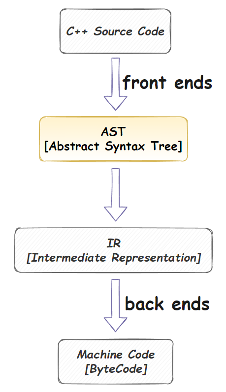
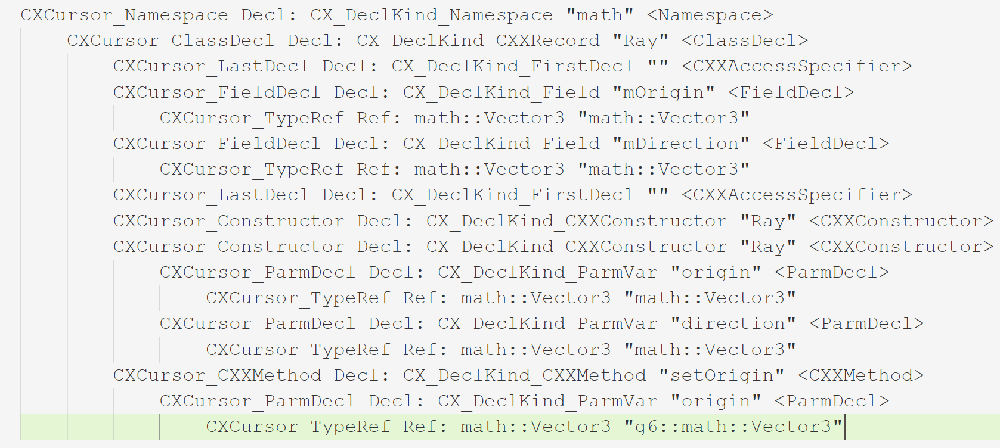
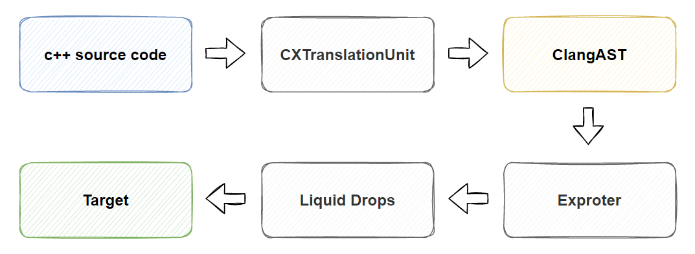
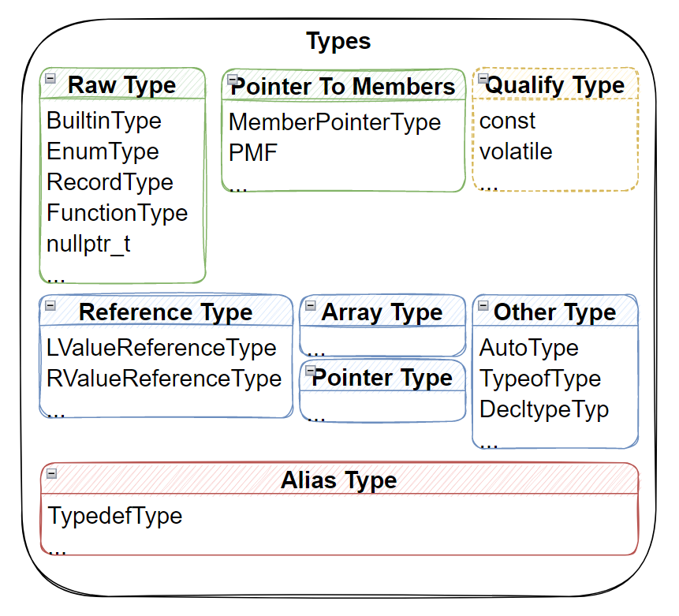
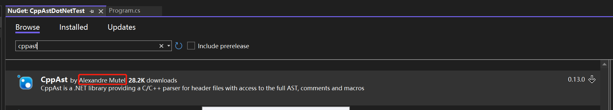
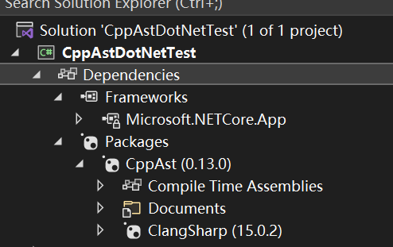
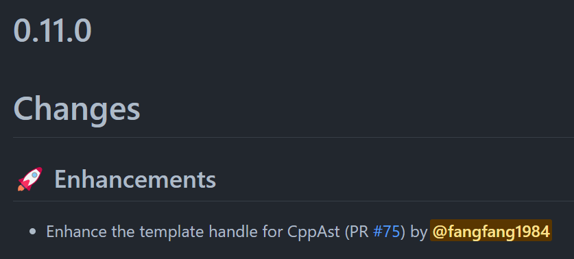
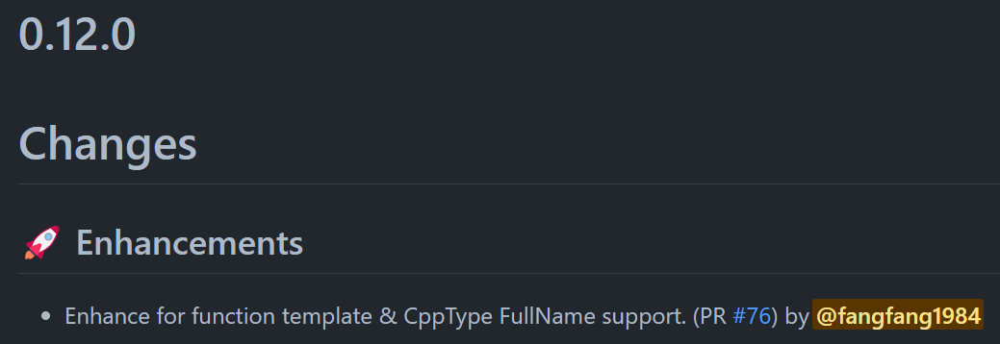
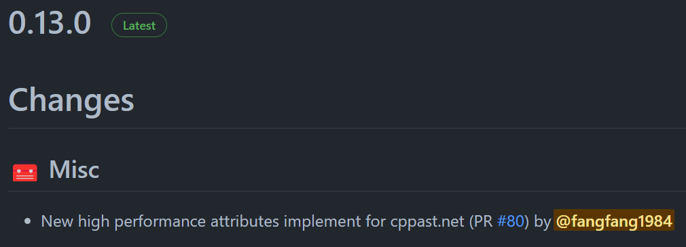
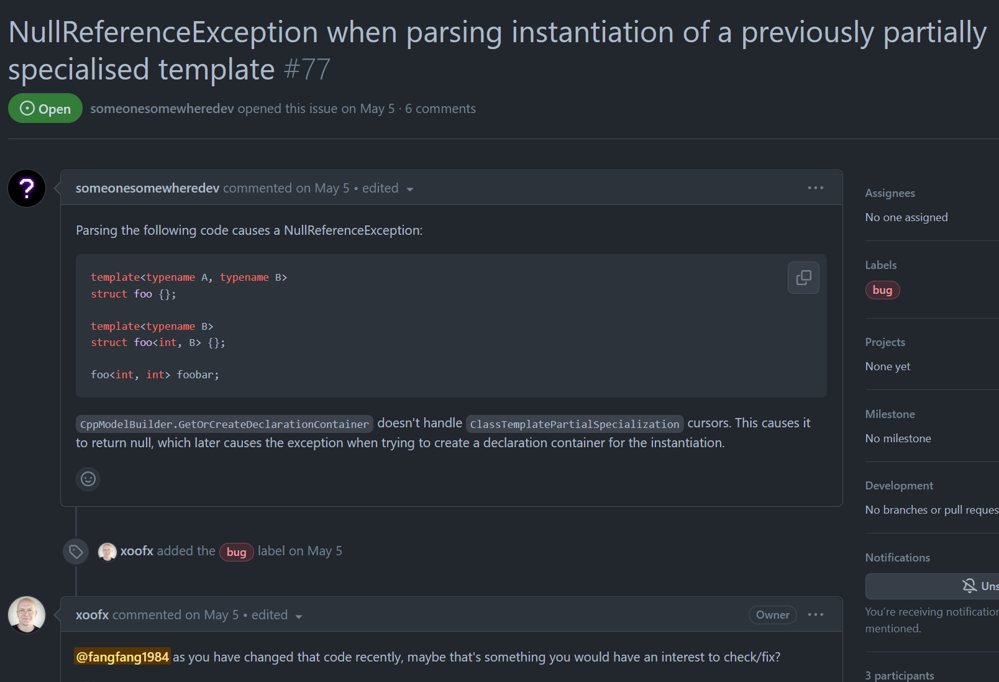

Author: fangfang
[原文知乎链接](https://zhuanlan.zhihu.com/p/654400068)
## 导语

现代的游戏引擎一般都会较重度的依赖代码生成技术, 而代码生成技术一般都是以原始代码为处理信息源, 再结合专用的配置来做进一步的处理. 发展到后来, 就渐渐变成原始代码和配置一体化的形式了. 比如大家熟知的UE使用的是在原始代码上利用宏来注入额外信息的方式, 然后再用自己专门实现的 UHT - Unreal Header Tool 来完成代码生成的目的. 早期的 UHT 使用 C++ 编写, 它采用的一个 2 Pass 解析相关头文件源码并提取相关信息进行生成的方式， 新版的 UE5 使用处理字符串更友好的 C# 重写了整个 UHT, 整体的实现对比之前的版本也更完整, 对对各类 C++ Token  的处理也更完备了。 笔者所参与的腾讯IEG自研的 3D 引擎同样也大量使用了代码生成技术，与UE相比， 我们并没有选择自己从头开始开发的代码生成工具， 而是综合历史经验和重新选型后，选择了直接在  C++ 抽象语法树（AST）层级来完成原始代码信息的提取， 以此为基础进行代码生成。早期我们直接使用了  libclang 的  Python Wrapper , 来完成相关的工作. 相关的维护成本和执行效率都不尽如人意, 重新调研之后我们选择了底层同样使用  libclang, 但整体设计和实现更合理, 使用更友好的 CppAst.Net 来完成这部分工作. 当然, 整个过程也不是一帆风顺的, 在对 CppAst.Net 做了几个关键功能的 PR 之后, 我们已经可以基于 CppAst.Net 很好的完成我们需要的代码解析和额外信息注入的功能了, 本文将重点介绍 C# 库 - CppAst.Net 的方方面面, 希望帮助大家更好的完成 C++ 代码分析或者代码生成相关的工具.

---
## 1. 代码生成简介 

&emsp;&emsp;导语部分也有提到了, 现代的游戏引擎一般都会较重度的依赖代码生成技术, 我们先来看一个IEG自研引擎 CE中的一个实际的例子 - Vector3 类的反射注册代码:

**C++ 中的 Vector3 类:**
```cpp
//-------------------------------------
//declaration
//-------------------------------------
class Vector3 {
 public:
  double x;
  double y;
  double z;
 public:
  Vector3() : x(0.0), y(0.0), z(0.0) {}
  Vector3(double _x, double _y, double _z) : x(_x), y(_y), z(_z) {}
  double DotProduct(const Vector3& vec) const;
};
```

**Vector3类的反射注册代码:**
```cpp
//-------------------------------------
//register code
//-------------------------------------
__register_type<Vector3>("Vector3")
		.constructor()
		.constructor<double, double, double>()
		.property("x", &Vector3::x)
		.property("y", &Vector3::y)
		.property("z", &Vector3::z)
		.function("DotProduct", &Vector3::DotProduct);
		;
```
即可以完成对它的构造函数以及几个属性的反射注册, 然后我们就可以通过反射库来使用它了.  
实际的工程应用中, 虽然选择手动为每个类去实现注册代码也是一种方式. 但这种方式明显工作量巨大, 而且容易出现修改原始实现的时候, 可能就漏改注册部分代码的情况, 肯定不是一种特别可取的方式.
这种情况下, 我们就会考虑使用更 "自动化" 的机制来解决注册代码的生成问题, 这也是目前CE所选择的方式,  CE中整体的反射代码自动生成流程大致如下图所示:

对比常规的`C++`编译处理过程[上图中的Normal Mode], 我们合理安排编译管线, 利用 `libclang`, 形成如右侧所示的二次 `Compile` 过程:
- 第一次编译发生在工具内, 仅处理头文件, 用于提取必须的信息, 如类的定义等.
- 第二次是真实的正常编译过程, 将工具额外产生的文件一起加入整个编译生成.
这样, 利用工具自动生成的一部分注册代码, 与原来的代码一起进行编译, 我们就能得到一个运行时信息完备的反射系统了.
&emsp;&emsp;其他诸如脚本语言的中间层自动生成的原理与这里的情况也差不多, 利用这种 `header only libclang compile` 的模式, 我们都能够比较好的去组织离线工具的实现逻辑, 来完成需要代码的生成. 看起来是不是很美好的一个现状? 


---
## 2. libclang - 带来希望, 也带来迷茫
&emsp;&emsp;早期没有llvm库的时候, 我们只能通过正则匹配等字符串模式匹配的方式来完成相关工作, 这种方式比较大的弊端一方面是效率, 另外一方面是业务程序对代码的组织方式可能破坏自动工具的工作, 排查和定位相关问题又不是那么直接. 
在llvm库流程后, 越来越多的人开始尝试在AST这一层对源代码信息进行提取, 这样相关的问题就回归到了c++本身来解决了, 这肯定比前面说的基于字符串的机制要稳定可控非常多, 相关的问题也更容易定位排查. 要使用这种方式, 我们先来简单的了解一下libclang.

### 2.1 libclang 和它带来的改变
&emsp;&emsp;libclang是llvm工具链中的一部分, 整个llvm的工作过程简单来说可以看成下图所示:

而libclang主要用于处理c++源码 -> AST 这部分的工作. 我们的代码生成工具主要就是利用这部分的能力, 在获取到AST后, 基于一些配置信息进行代码生成相关的工作.

&emsp;&emsp;像上面介绍的 CE 的方案一样, 基于 libclang 和二次编译, 我们可以在设计层面整理出一个很简洁的离线代码生成工具的流程, 但基于libclang离线工具的实际实现过程中依然还是会碰到种种问题:
1. libclang的编译问题 - 跨平台使用的情况下复杂度更高. [可参考文章此处文章了解一些详情](https://zhuanlan.zhihu.com/p/522301633)
2. 如何选择 `libclang` 的使用语言, 是C++,  Python, C#, 还是其他?
3. 如何支持好C++中大量使用的各种模板类型?
4. 生成信息的标记和额外信息的注入如何解决, 如UE里大量使用的 Property 在Editor中使用到的各种信息的注入?
5. 如何更好的组织生成代码, 避免工具中大量的字符串拼接代码的存在?

除了上面列的这些问题, 还有以下这些 libclang 和 C++ 复杂度本身带来的问题:

### 2.2 libclang 本身的 Cursor 机制带来的限制
&emsp;&emsp;libclang 本身是以 Cursor 的方式来对 AST 进行表达的, 比如对于下面的类:
```cpp
namespace math {

class Ray {
 protected:
  Vector3 mOrigin;
  Vector3 mDirection;
 public:
  Ray();
  Ray(const Vector3& origin, const Vector3& direction);

  /** Sets the origin of the ray. */
  void setOrigin(const Vector3& origin);
  //... something ignore here
};

} //namespace math
```
对应的AST如下:

与源码一一对应的看, 还是比较好了解 AST 中对应 Cursor 的作用的. 我们可以看到 libclang 以各种类型的 CXCursor的方式来构建整个AST,  复杂度较高的Cursor主要还是集中在Stmt和Exprs部分. 但因为跟源代码语法基本是一一对应的关系,  熟悉起来其实也比较快. 以下是 CXCursor的一个分类情况:

本身CXCursor的分类和使用并没有什么障碍, 但 libclang 主要访问某个节点下的子节点的方式, 更多是按回调的方式来提供的, 如我们用来Dump一个CXCursor信息的局部代码所示:
```cs
private static void PrintASTByCursor(CXCursor cursor, int level, List<string> saveList)
{
	bool needPrintChild = true;
	saveList.Add(GetOneCursorDetails(cursor, level, out needPrintChild));

	unsafe
	{
		PrintCursorInfo cursorInfo = new PrintCursorInfo();
		cursorInfo.Level = level + 1;
		cursorInfo.SaveList = saveList;
		GCHandle cursorInfoHandle = GCHandle.Alloc(cursorInfo);

		cursor.VisitChildren(VisitorForPrint,
			new CXClientData((IntPtr)cursorInfoHandle));
	}
}
```
这给我们实现代码分析和生成工具造成了极大的不便, 因为很多时候我们的处理工具没有办法对 AST 做单次处理就完成所有的事情, 很多事项是需要依赖重复访问某个 CXCursor以及其子级来完成的.
&emsp;&emsp;所以曾经在 Tencent 的一个老项目的时候, 我们是通过 C# 来访问 libclang 的(使用 ClangSharp ), 当时我们就尝试自己在 C# 层中完整的保存了一份来自 libclang 的数据层, 当然, 这个数据层肯定也是通过 libclang 原生的回调方式一次性获取的, 这样离线工具与 libclang 的原生 AST就解耦了, 也不会有 libclang 回调和多次获取数据不便的问题了. 当时加入 C# 数据层后的的工作流程大致如下:
加入自定义的结构化ClangAST层, 整个处理流程如下所示:


但当时的实现其实也存在一些问题, 同时使用了 ClangSharp 的 LowLevel 接口, 以及 HighLevel 接口, 而ClangSharp的 HighLevel 接口实现质量其实并不高. 另外因为中间数据层的存在, 整体实现代码量并不少, 上手相关工具的复杂度其实并没有降低. 这其实也是后面会考虑转向 CppAst.Net 实现的一大原因之一.

### 2.3 C++ 类型系统的复杂度
&emsp;&emsp;除了上面提到的 libclang 本身带来的问题, C++复杂的类型系统也是离线生成工具处理的一大难点, 如下图所示, 我们给出了 C++ 中大概的类型分类:

类型系统的复杂度主要体现在:
- C++中众多的 builtin 类型
- 用户可以通过自定义的方法扩展大量的 UDT (如class和enum等)
-  c++支持如Pointer和Reference, Array这些进阶类型, 这些类型还能相互嵌套作用
- 类型可以加const, volatile等修饰, 形成新的类型
- 我们还能通过`using`, `typedef`为类型指定别名
- 再加上c++11开始扩展的关键字, 我们可能还会使用`auto`, `decltype`, `typeof`进行类型表达
- 模板的支持带来了更复杂的类型系统表达(复杂度比较高, 本篇直接先略过了).

所以整个类型系统的复杂度是步步攀升, 基本上离线工具处理的难点就集中在这一部分了.
当从某个Cursor中解析到一个Type, 很多时候我们需要层层递进的分析, 才能最终解析出它实际的类型. 这其实也是我们后面会具体说到的 CppAst.Net的一个优势, 它基本在 C# 层相对完整的实现了 C++的这个类型系统, 这样虽然类型系统本身的复杂度还是存在的, 但我们在 C# 层可以以比较接近原生 C++ 的方式对各个类型进行很好的处理, 再加上 C# 本身运行时完备的类型信息, 很多问题都能够得到有效的简化处理了.

---
## 3. CppAst.Net - 新的天花板
&emsp;&emsp;前面的铺垫比较长, 终于迎来我们的正主 [CppAst.Net](https://github.com/xoofx/CppAst.NET)了, 还是按照老规矩, **我们先来看一段 CppAst.Net 官网上的示例代码:**
```cs
// Parse a C++ files
var compilation = CppParser.Parse(@"
enum MyEnum { MyEnum_0, MyEnum_1 };
void function0(int a, int b);
struct MyStruct { int field0; int field1;};
typedef MyStruct* MyStructPtr;
"
);
// Print diagnostic messages
foreach (var message in compilation.Diagnostics.Messages)
    Console.WriteLine(message);

// Print All enums
foreach (var cppEnum in compilation.Enums)
    Console.WriteLine(cppEnum);

// Print All functions
foreach (var cppFunction in compilation.Functions)
    Console.WriteLine(cppFunction);

// Print All classes, structs
foreach (var cppClass in compilation.Classes)
    Console.WriteLine(cppClass);

// Print All typedefs
foreach (var cppTypedef in compilation.Typedefs)
    Console.WriteLine(cppTypedef);
```
**相应的输出:**
```cs
enum MyEnum {...}
void function0(int a, int b)
struct MyStruct { ... }
typedef MyStruct* MyStructPtr
```

从上面的示例中我们已经可以看到 CppAst.Net 的一些优势:
1. C# 侧提供了各种高级的类型, 如 CppFunction, CppClass, CppEnum 等, 整个 C# 侧重新组织的 AST 也是不依赖回调就能直接按 foreach 的方式进行访问的.
2. 能够支持直接从字符串构建 Compilation, 这样也方便实现单元测试.

### 3.1 简单配置即可上手使用
&emsp;&emsp;CppAst.Net底层是依赖ClangSharp的, 有过 ClangSharp 使用经念的同学可能都知道, 整个编译运行的体验可能并不太好, 从 NuGet 添加了 ClangSharp 包之后, 可能我们直接运行相关的示例和测试代码, 还是会提示 `libclang.dll/ligclang.so` 找不到之类的问题, 体验不会特别好, 这个其实也不能全怪 ClangSharp, 主要还是 NuGet 对包本身依赖的原生二进制的大小做了一些限制, 因为这个问题可能比较多人遇到, 我们先贴出一下相关的 Workaround, 方便大家更好的运行自己的测试代码:
```xml
<PropertyGroup>
    <!-- Workaround for issue https://github.com/microsoft/ClangSharp/issues/129 -->
    <RuntimeIdentifier Condition="'$(RuntimeIdentifier)' == '' AND '$(PackAsTool)' != 'true'">$(NETCoreSdkRuntimeIdentifier)</RuntimeIdentifier>
</PropertyGroup>
```

对于前面说到的官方示例代码, 我们可以尝试从零开始建立一个` C# .netcore 3.1` 的Console App, 一步一步将其运行起来:

#### 3.1.1 新建工程
**打开 Visual Studio  建立一个C# Console App (笔者当前使用的环境是 VS 2022):**


**配置项目名称:**


**选定.net 版本(这里我们直接用.net core3.1):**


#### 3.1.2 通过 NuGet 添加 `CppAst.Net` 包
**打开NuGet包管理器:**


**添加CppAst.Net包:**


**操作完成后, 我们在项目的依赖里就可以看到 CppAst.Net 包了:**


#### 3.1.3 针对 csproj 的 Workaround
 &emsp;&emsp;我们还需要一步针对前面提到的找不到 native dll 的 Workaround,  打开工程对应的 csproj文件进行编辑, 添加前面提到的 Workaround, 正确配置 native dll 加载需要的信息:
```xml
<Project Sdk="Microsoft.NET.Sdk">

  <PropertyGroup>
    <OutputType>Exe</OutputType>
    <TargetFramework>netcoreapp3.1</TargetFramework>

    <!-- Workaround for issue https://github.com/microsoft/ClangSharp/issues/129 -->
    <RuntimeIdentifier Condition="'$(RuntimeIdentifier)' == '' AND '$(PackAsTool)' != 'true'">$(NETCoreSdkRuntimeIdentifier)</RuntimeIdentifier>
  </PropertyGroup>

  <ItemGroup>
    <PackageReference Include="CppAst" Version="0.13.0" />
  </ItemGroup>

</Project>

```
也就是上面的 `RuntimeIdentifier` 项, 这个是必须的, 不然容易出现运行时找不到 libclang 的 native dll的报错.

#### 3.1.4 添加示例代码后测试运行对应的App
**在Program.cs的Main()函数中添加测试代码:**
```cs
static void Main(string[] args)
{
	// Parse a C++ files
	var compilation = CppParser.Parse(@"
enum MyEnum { MyEnum_0, MyEnum_1 };
void function0(int a, int b);
struct MyStruct { int field0; int field1;};
typedef MyStruct* MyStructPtr;
"
	);
	// Print diagnostic messages
	foreach (var message in compilation.Diagnostics.Messages)
		Console.WriteLine(message);

	// Print All enums
	foreach (var cppEnum in compilation.Enums)
		Console.WriteLine(cppEnum);

	// Print All functions
	foreach (var cppFunction in compilation.Functions)
		Console.WriteLine(cppFunction);

	// Print All classes, structs
	foreach (var cppClass in compilation.Classes)
		Console.WriteLine(cppClass);

	// Print All typedefs
	foreach (var cppTypedef in compilation.Typedefs)
		Console.WriteLine(cppTypedef);


	Console.WriteLine("Hello World!");
}
```

**编译运行程序:**


我们的第一个 CppAst.Net 应用就跑起来了, 是不是比预期的简单很多? 说完如何运行示例代码, 我们再回过头来探索 CppAst.Net 的类型系统.
### 3.2 `C#` 侧完整表达的类型系统
&emsp;&emsp;前文中其实也提到了, CppAst.Net 几个比较有优势的点, 我们这里再总结一下:
1. 配置使用简单, 支持直接从字符串解析 C++代码
2. C#层有完整的数据层 - 代码Parse后会直接将所有信息C#化并存储在我们前面代码中看到的 CppCompilation 中
3. C# 层中对 C++类型系统的重建还原比较好

第三点通过 CppAst.Net 的类图其实就能看出来:

再加上具体C#类型实现上的Property, 如我们前面看到的CppCompilation上的各个属性:
- Namespaces - 编译单元中包含的命名空间
- Enums - 编译单元包含的枚举 
- Functions - 编译单元中包含的函数(一般就是全局函数了)
- Classes - 编译单元中包含的类
- Typedefs - 编译单元中包含的 typedef 类型
- ...
通过C#侧重新组织整个AST的外观, 我们实际体验会发现对整个 C++ AST 的信息读取和多遍操作变简单了.

### 3.3 从 Test 了解 CppAst.Net 的基础功能
&emsp;&emsp;我们快速了解 CppAst.Net 的基础功能, 直接下载 CppAst.Net 的[源代码](https://github.com/xoofx/CppAst.NET), 参考运行其中的 CppAst.Tests 工程是比较推荐的方式, 其中的代码都是针对具体功能的测试, 而且绝大部分都是像我们上面例子中一样, 直接用字符串的方式传入 C++ 代码后再 Parse 生成 CppCompilation 后再去测试其中的功能, 我们可以调整其中的实现进行快速测试, 从中了解 CppAst.Net 提供的 Features 是非常方便的.


---
## 4. 强化 CppAst.Net
&emsp;&emsp;实际使用的过程中我们也发现了 CppAst.Net 原有版本(0.10版) 实现的一些功能缺失, 我们在 0.11, 0.12, 0.13版逐步追加了一些功能, 主要包括:
1. 模板, 以及模板特化, 部分特化的支持
2. CppType 的 FullName和Name的支持
3. 高性能的 meta attribute实现支持
以更好的支持我们的项目, 本身也是一个对 CppAst.Net开源库索取和反哺的过程:





个人感觉这其实也是一种比较不错的协作方式, 一方面我们通过引入 CppAst.Net, 首先是原来自己维护的大量代码变为了一个第三方库, 我们甚至可以不使用源码, 直接以 NuGet 的方式引入对应包就可以了, 对于团队其他小伙伴要了解相关工具的实现, 就变得比原来简单非常多. 另外在项目实际落地的过程中, 我们也会发现一些 CppAst.Net 不那么完善或者功能有缺失的地方, 这样我们补齐相关功能后反哺到开源库, 本身也会让 CppAst.Net 变得更完备更好用.  下文我们会具体展开一下模板相关的功能和 meta attribute 相关的功能.

### 4.1 模板的支持与处理
&emsp;&emsp;当时提交 Template 相关的 PR 的时候, 因为是多个 commit 一次提交的, 有一个 PR 漏合了, 所以当时社区有人发现有问题并提交了相关的测试代码:

后面我就直接用这个代码作为单元测试代码, 并且完整添加了模板偏特化和部分特化的支持, 让 CppAst.Net 显示的区分了模板参数和模板特化参数, 这样就能更好的获取模板, 以及模板特化实例相关的信息了, 这里我们直接来看一下相关的单元测试代码:

```cs
       [Test]
        public void TestTemplatePartialSpecialization()
        {
            ParseAssert(@"
template<typename A, typename B>
struct foo {};

template<typename B>
struct foo<int, B> {};

foo<int, int> foobar;
",
                compilation =>
                {
                    Assert.False(compilation.HasErrors);

                    Assert.AreEqual(3, compilation.Classes.Count);
                    Assert.AreEqual(1, compilation.Fields.Count);

                    var baseTemplate = compilation.Classes[0];
                    var fullSpecializedClass = compilation.Classes[1];
                    var partialSpecializedTemplate = compilation.Classes[2];

                    var field = compilation.Fields[0];
                    Assert.AreEqual(field.Name, "foobar");

                    Assert.AreEqual(baseTemplate.TemplateKind, CppAst.CppTemplateKind.TemplateClass);
                    Assert.AreEqual(fullSpecializedClass.TemplateKind, CppAst.CppTemplateKind.TemplateSpecializedClass);
                    Assert.AreEqual(partialSpecializedTemplate.TemplateKind, CppAst.CppTemplateKind.PartialTemplateClass);

                    //Need be a specialized for partial template here
                    Assert.AreEqual(fullSpecializedClass.SpecializedTemplate, partialSpecializedTemplate);

                    //Need be a full specialized class for this field
                    Assert.AreEqual(field.Type, fullSpecializedClass);

                    Assert.AreEqual(partialSpecializedTemplate.TemplateSpecializedArguments.Count, 2);
                    //The first argument is integer now
                    Assert.AreEqual(partialSpecializedTemplate.TemplateSpecializedArguments[0].ArgString, "int");
                    //The second argument is not a specialized argument, we do not specialized a `B` template parameter here(partial specialized template)
                    Assert.AreEqual(partialSpecializedTemplate.TemplateSpecializedArguments[1].IsSpecializedArgument, false);

                    //The field use type is a full specialized type here~, so we can have two `int` template parmerater here
                    //It's a not template or partial template class, so we can instantiate it, see `foo<int, int> foobar;` before.
                    Assert.AreEqual(fullSpecializedClass.TemplateSpecializedArguments.Count, 2);
                    //The first argument is integer now
                    Assert.AreEqual(fullSpecializedClass.TemplateSpecializedArguments[0].ArgString, "int");
                    //The second argument is not a specialized argument
                    Assert.AreEqual(fullSpecializedClass.TemplateSpecializedArguments[1].ArgString, "int");
                }
            );
        }
```

### 4.2 `meta attribute` 支持
&emsp;&emsp;这一部分我们在CppAst.Net的代码仓库里添加了一个具体的文档 [attributes.md](https://github.com/xoofx/CppAst.NET/blob/main/doc/attributes.md), 感兴趣的读者可以自行查阅, 主要是用来解决上面提到的需要对某些导出项进行配置, 但又不希望代码项和配置信息分离的问题的, 原来 CppAst.Net 也有一版自己的基于再次 token parse 的 token attributes实现, 不过实际用于项目存在一些社区中比较多反馈的问题:
1. `ParseAttributes()` 耗时巨大, 所以导致了后来的版本中加入了`ParseAttributes` 参数来控制是否解析 `attributes`, 但某些场合, 我们需要依赖 `attributes` 才能完成相关的功能实现. 这显然带来了不便.
    
2. 对 `meta attribute` - `[[]]` 的解析存在缺陷, 像 `Function` 和 `Field` 上方定义的 `meta attribute`, 在语义层面, 显然是合法的, 但 `cppast.net` 并不能很好的支持这种在对象上方定义的`meta attribute` (这里存在一些例外情况, 像 `namespace`, `class`, `enum` 这些的 `attribute` 声明, attribute定义本身就不能位于上方, 相关的用法编译器会直接报错, 只能在相关的关键字后面, 如 `class [[deprecated]] Abc{};` 这种 ).
    
3. `meta attribute` 个别参数使用宏的情况. 因为我们原有的实现是基于 `token` 解析来实现的, 编译期的宏显然不能很好的在这种情况下被正确处理.

所以这一部分我们沿用了在腾讯的一个老项目时的思路, 重新对 CppAst.Net的相关实现做了重构和扩展, 我们重新将 `attribute` 分为了三类:
1. `AttributeKind.CxxSystemAttribute` - 对应的是 `libclang` 本身就能很好的解析的各类系统 `attribute`, 如上面提到的 `visibility`, 以及 `[[deprecated]]`, `[[noreturn]]` 等. 借助`ClangSharp` 就能够高效的完成对它们的解析和处理, 也就不需要考虑开关的问题了.
2. `AttributeKind.TokenAttribute` - 从名字上我们能猜出, 这对应的是`cppast.net`原来版本中的 `attribute`, 已经标记为 `deprecated` 了, 但`token` 解析始终是一种保底实现机制, 我们会保留相关的 `Tokenizer` 的代码, 在一些 `ClangSharp` 没有办法实现相关功能的情况谨慎的使用它们来实现一些复杂功能.
3. `AttributeKind.AnnotateAttribute` - 用来取代原先基于 `token` 解析实现的 `meta attribute`, 以高性能低限制的实现前面介绍的为类和成员注入的方式.

而我们用来解决配置数据注入的, 就是第三种实现  `AttributeKind.AnnotateAttribute` 了. 下面我们来简单看一下它的实现和使用:

#### 4.2.1 `AttributeKind.AnnotateAttribute`
&emsp;&emsp;我们需要一种绕开`token` 解析的机制来实现 `meta attribute`, 这里我们巧妙的使用了 `annotate` 属性来完成这一项操作, 从新增的几个内置宏我们可以看出它是如何起作用的:
```cs
            //Add a default macro here for CppAst.Net
            Defines = new List<string>() { 
                "__cppast_run__",                                     //Help us for identify the CppAst.Net handler
                @"__cppast_impl(...)=__attribute__((annotate(#__VA_ARGS__)))",          //Help us for use annotate attribute convenience
                @"__cppast(...)=__cppast_impl(__VA_ARGS__)",                         //Add a macro wrapper here, so the argument with macro can be handle right for compiler.
            };
```
> [!note] 
> 此处的三个系统宏不会被解析为 `CppMacro` 加入最终的解析结果中, 避免污染输出结果. 

最终我们其实只是将 `__VA_ARGS__` 这个可变参数转为字符串并利用 `__attribute__((annotate(???)))` 来完成信息的注入, 这样如果我们像测试代码中一样, 在合适的地方加入:
```cpp
#if !defined(__cppast)
#define __cppast(...)
#endif
```
当代码被 `cppast.net` 解析时, 相关的输入会被当成`annotate attribute` 被正确的识别并读取, 而在非 `cppast.net` 的情况下, 代码也能正确的忽略`__cppast()` 中注入的数据, 避免干扰实际代码的编译执行, 这样我们就间接的完成了 `meta attribute` 注入和读取的目的了.

对于宏的情况:
```cpp
#if !defined(__cppast)
#define __cppast(...)
#endif

#define UUID() 12345

__cppast(id=UUID(), desc=""a function with macro"")
void TestFunc()
{
}
```
相关的测试代码:
```cs
//annotate attribute support on namespace
var func = compilation.Functions[0];
                    Assert.AreEqual(1, func.Attributes.Count);
                    Assert.AreEqual(func.Attributes[0].Kind, AttributeKind.AnnotateAttribute);
                    Assert.AreEqual(func.Attributes[0].Arguments, "id=12345, desc=\"a function with macro\"");
```
因为我们定义`__cppast` 的时候, 做了一次 `wrapper` 包装, 我们发现宏也能很好的在`meta attribute` 状态下工作了.

而对于`outline attribute` 的情况, 像`Function`, `Field`, 本身就能很好的支持, 甚至你可以在一个对象上定义多个`attribute`, 同样也是合法的:
```cpp
__cppast(id = 1)
__cppast(name = "x")
__cppast(desc = "???")
float x;
```


## 5. 小结
本文我们从离线代码生成工具出发, 逐步介绍了:
1. 代码生成相关的内容
2. libclang带来的改变和限制
3. CppAst.Net的基础使用
4. CppAst.Net的两个扩展实现, 模板的支持和 meta attribute的注入和使用
希望大家通过阅读本文能够对如何处理 C++ AST以及如何使用 CppAst.Net 有一个初步的认知.


