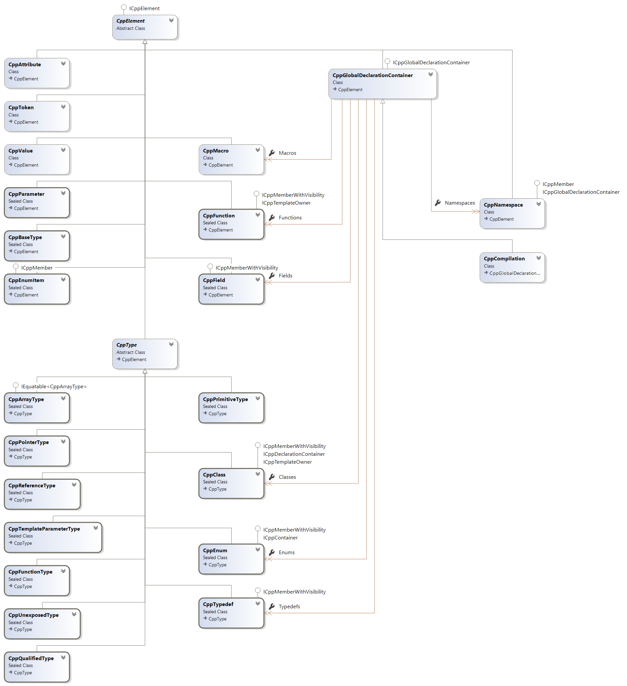

# CppAst User Guide

## Overview

The entry point for parsing C/C++ header files with CppAst is the [`CppParser`](../src/CppAst/CppParser.cs) class:

- `CppParser.Parse` parses in-memory C/C++ text.
- `CppParser.ParseFile` parses a single file from disk.
- `CppParser.ParseFiles` parses multiple files from disk.

The default parser mode is C++ (`CppParserKind.Cpp`). Use `CppParserOptions.ParserKind` to select C (`CppParserKind.C`) or Objective-C (`CppParserKind.ObjC`) mode when needed.

These methods return a [`CppCompilation`](../src/CppAst/CppCompilation.cs) object which contains:

- A `HasErrors` property set to `true` if parsing produced any errors.
- A `Diagnostics` property for warnings, errors and the abort warning emitted after parse errors.
- Several lists of C/C++ elements via the `CppCompilation` properties:
  - `Macros`
  - `Classes`
  - `Enums`
  - `Fields`
  - `Functions`
  - `Typedefs`
  - `Namespaces`
- `InclusionDirectives` for `#include` directives.
- Access to declarations parsed from system includes via the `System` property, which is itself a container for macros, enums, fields, functions, classes, namespaces, typedefs and inclusion directives.

For example, to print all structs and fields defined in the global scope:

```C#
// Print all structs with all fields
foreach(var cppStruct in compilation.Classes)
{
    // Skip non struct
    if (cppStruct.ClassKind != CppClassKind.Struct) continue;
    Console.WriteLine($"struct {cppStruct.Name}");

    // Print all fields
    foreach(var cppField in cppStruct.Fields)
        Console.WriteLine($"   {cppField}");

    Console.WriteLine("}");
}
```

## Class diagram



## Parser options

You can configure the behavior of the parser by passing a [`CppParserOptions`](../src/CppAst/CppParserOptions.cs) object:

```c#
var options = new CppParserOptions()
{
    // Pass the defines -DMYDEFINE to the C++ parser
    Defines = {
        "MYDEFINE"
    }
};
var compilation = CppParser.ParseFile("...",  options);
```

Common options include:

| Option | Default | Purpose |
| --- | --- | --- |
| `ParserKind` | `CppParserKind.Cpp` | Select C++, C or Objective-C language mode. |
| `IncludeFolders` / `SystemIncludeFolders` | empty | Add `-I` / system include search paths. |
| `Defines` | includes CppAst `__cppast` helper macros | Add preprocessor definitions. |
| `AdditionalArguments` | `-Wno-pragma-once-outside-header` | Pass extra arguments to Clang, for example `-std=c++17`. |
| `ParseMacros` | `false` | Collect macro definitions, parameters and tokens. |
| `ParseComments` | `true` | Parse attached comments, including Doxygen commands. |
| `ParseSystemIncludes` | `true` | Include declarations from headers found through `SystemIncludeFolders`. |
| `ParseTokenAttributes` | `false` | Enable deprecated token-level attribute parsing for compatibility. |
| `ParseCommentAttribute` | `false` | Parse comment-based attributes into `Attributes`. |
| `ParseFunctionBodies` | `false` | Keep source spans for function bodies; this does not build a statement-body AST. |
| `PreHeaderText` / `PostHeaderText` | `null` | Inject text before or after the parsed input. |
| target properties / `ConfigureForWindowsMsvc(...)` | host-sized Windows triple | Configure the Clang target triple and MSVC compatibility defines. |

## Source information

All elements inherit from the base class [`CppElement`](../src/CppAst/CppElement.cs) that provides precise source span/location information via the property `CppElement.Span`

## Containers

A few C/C++ elements can be container of other C++ elements:

- A [`CppCompilation`](../src/CppAst/CppCompilation.cs) root container for all global scope C/C++ elements
- A [`CppClass`](../src/CppAst/CppClass.cs) can contain fields, classes/structs/unions, methods...
- A [`CppNamespace`](../src/CppAst/CppNamespace.cs) can contain fields, classes/structs/unions, methods, nested namespaces

## Type System

All type classes in CppAst inherit from `CppType`:

- [`CppPrimitiveType`](../src/CppAst/CppPrimitiveType.cs) for all primitive types (e.g `int`, `char`, `unsigned int`)
- [`CppClass`](../src/CppAst/CppClass.cs) for struct, class and union. Use the property `CppClass.ClassKind` to detect which type is the underlying class. `CppClass.TemplateKind`, `TemplateParameters`, `TemplateSpecializedArguments` and `SpecializedTemplate` expose common C++ template metadata.
- [`CppEnum`](../src/CppAst/CppEnum.cs) for enum types (C++ scoped and regular enums)
- [`CppTypedef`](../src/CppAst/CppTypedef.cs) for a typedef (e.g `typedef int MyInteger`)
- [`CppPointerType`](../src/CppAst/CppPointerType.cs) for pointer types (e.g `int*`)
- [`CppReferenceType`](../src/CppAst/CppReferenceType.cs) for reference types (e.g `int&`)
- [`CppArrayType`](../src/CppAst/CppArrayType.cs) for array types (e.g `int[5]`)
- [`CppQualifiedType`](../src/CppAst/CppQualifiedType.cs) for qualified types (e.g `const int`)
- [`CppFunctionType`](../src/CppAst/CppFunctionType.cs) for function types (e.g `void (*)(int, int)`)
- [`CppBlockFunctionType`](../src/CppAst/CppBlockFunctionType.cs) for block function types.
- [`CppUnexposedType`](../src/CppAst/CppUnexposedType.cs) for Clang types that do not have a more specific CppAst model.

## Advanced

### Parsing macros

By default, CppAst doesn't parse macros. This can be enabled via `CppParserOptions.ParseMacros = true`

When enabled, `CppCompilation.Macros` contains macro names, optional function-like parameters and tokenized values. CppAst internal helper macros named `__cppast...` are filtered from the result.

### Parsing comments and attributes

Attached comments are parsed by default. Set `CppParserOptions.ParseComments = false` to disable comment parsing. Function `@param` commands are also associated with matching `CppParameter.Comment` entries when possible.

System/annotate attributes are exposed through the `Attributes` collection. Deprecated token-level attributes remain available through `TokenAttributes` only when `CppParserOptions.ParseTokenAttributes = true`. Comment attributes can be enabled with `CppParserOptions.ParseCommentAttribute = true`.

### Parsing function body spans

CppAst skips function bodies by default. Set `CppParserOptions.ParseFunctionBodies = true` to keep `CppFunction.BodySpan` for definitions. CppAst does not currently expose a full statement-level AST for body contents.

### Parsing Windows/MSVC headers

If you are looking to parse Windows headers with the behavior of the MSVC C++ compiler, you can configure

```c#
var options = new CppParserOptions().ConfigureForWindowsMsvc();
```

### Disable typedef auto-squash

By default, CppAst will squash a typedef to an un-named struct/union, rename the struct and discard the typedef:

```C
typedef struct { int a; int b; } MyStruct;
```

will be parsed as named C++ struct and available via `CppCompilation.Classes`

```C++
struct MyStruct { int a; int b; };
```

To disable this feature you should setup `CppParserOptions.AutoSquashTypedef = false`

## Current limitations

- CppAst exposes a compact managed AST, not every libclang cursor or statement node.
- Advanced template/dependent constructs can still appear as `CppUnexposedType` or display-name-only template arguments.
- Type sizes and built-in aliases such as `size_t` depend on the configured target triple/ABI.
- Prefer system/annotate attributes over deprecated token-level attributes for new code.
