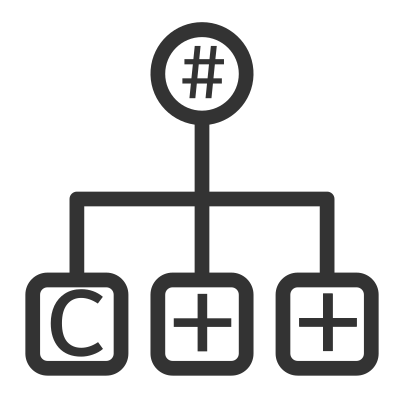

# CppAst [](https://ci.appveyor.com/project/xoofx/cppast)   [](https://www.nuget.org/packages/CppAst/)




CppAst provides a C/C++ parser for header files with access to the full AST, comments and macros for .NET Framework and .NET Core

> NOTE: This repository is still under development and is not usable for public consumption

```C#
// Parse a C++ files
var compilation = CppParser.Parse("my_file_header.h");
foreach(var cppClass in compilation.Classes)
{
    Console.WriteLine($"Class {cppClass.Name}")
}
```
## Features

TBD

## Binaries

TBD

## Documentation

TBD

## License

This software is released under the [BSD-Clause 2 license](https://opensource.org/licenses/BSD-2-Clause). 

## Credits

* [ClangSharp](https://github.com/microsoft/ClangSharp): .NET managed wrapper around Clang/libclang

## Author

Alexandre Mutel aka [xoofx](http://xoofx.com).
